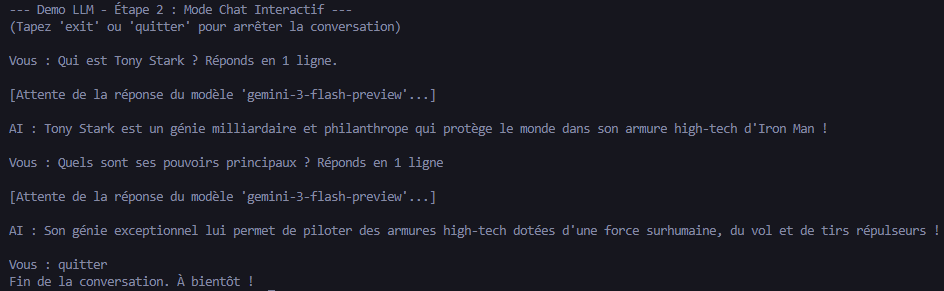
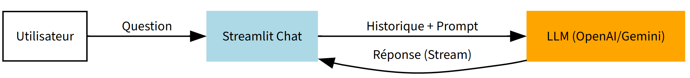
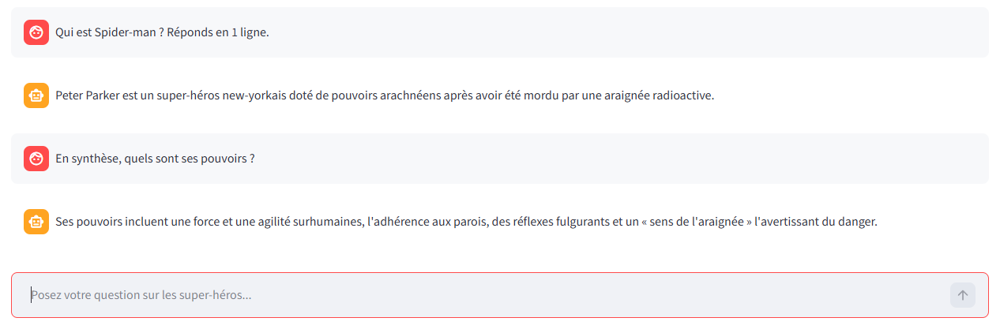
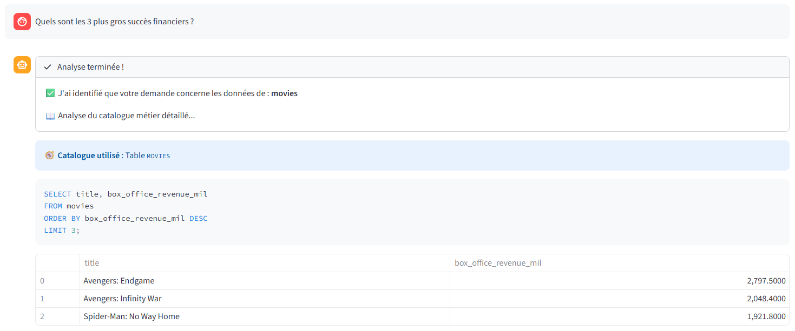
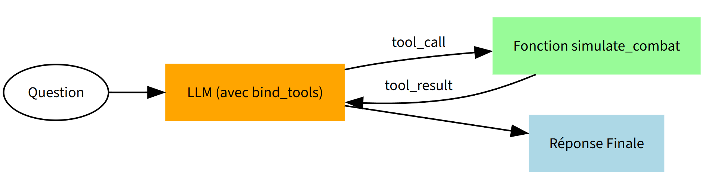
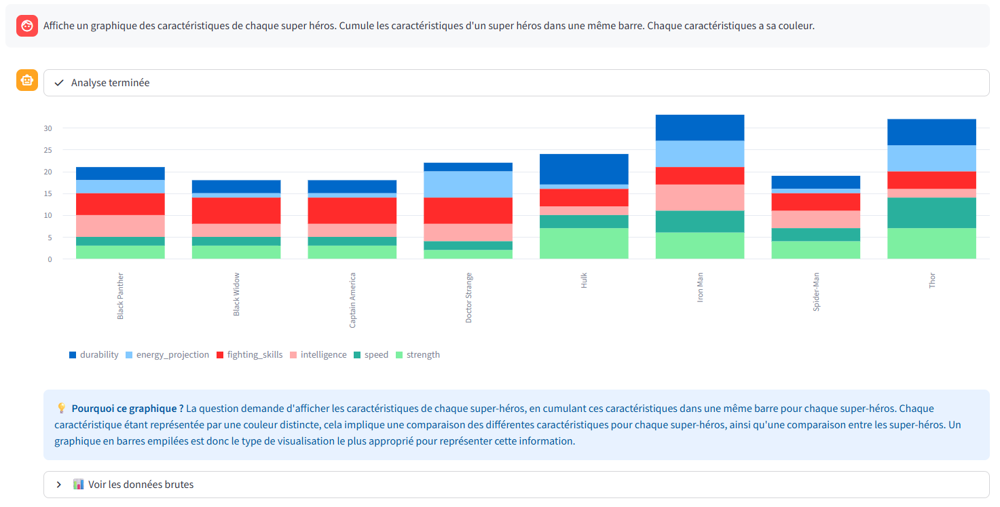

# 🦸 Demo LLM : Le Voyage de l'Apprenti AI-Agent

Bienvenue dans ce dépôt pédagogique conçu pour explorer et démontrer les capacités des Large Language Models (LLM) à travers un cas d'usage concret : l'univers **Marvel**.

Ce projet est structuré comme une progression par étapes, partant d'un simple appel API pour aboutir à un **Agent Intelligent** capable de manipuler du SQL, d'appeler des outils tiers (APIs REST) et de générer des visualisations de données.

---

## 🏗️ Architecture & Philosophie
Le dépôt est organisé de manière incrémentale. Chaque étape est souvent auto-suffisante pour faciliter la lecture du code et la compréhension des concepts techniques.

**Technologies utilisées :**
- **LangChain** (Orchestration LLM & Tools)
- **LangGraph** (Routage complexe & Orchestration d'états)
- **FastAPI** (Service REST externe)
- **Streamlit** (Interfaces Web)
- **SQLite** (Données structurées)
- **FAISS** (Base de données vectorielle)

---

## 🚀 Guide de Démarrage Rapide

1. **Configuration :** Créez un fichier `.env` à la racine avec les variables suivantes :
   ```env
   LLM_MODEL=votre_model_name
   LLM_API_KEY=votre_cle_api
   LLM_BASE_URL=url_du_endpoint
   ```
2. **Installation :** Installez les dépendances via votre gestionnaire Python (recommandé : virtual env).
   ```bash
   pip install langchain langchain-openai langchain-community langgraph streamlit pandas fastapi uvicorn fastembed faiss-cpu
   ```

---

## 🪜 Les 10 Étape de la Démo

### Phase 1 : Interactions Fondamentales
*   **Étape 1 : Le Premier Appel**  
    `python 01_simple_api.py`  
    Appel direct au LLM sans mémoire.
    

*   **Étape 2 : Conversation en Terminal**  
    `python 02_chat_terminal.py`  
    Introduction de l'historique de conversation (Memory).
    

*   **Étape 3 : Première Interface Graphique**  
    `streamlit run 03_streamlit_chat.py`  
    Migration vers une UI Web avec streaming des réponses.
    ````carousel
    
    <!-- slide -->
    
    ````

### Phase 2 : RAG (Retrieval Augmented Generation)
*   **Étape 4 : Génération de Données**  
    `python 04_generate_data.py`  
    Création de fiches descriptives Marvel (.txt) pour la base de connaissances.
*   **Étape 5 : Mise en place du RAG**  
    `python 05a_create_vector_db.py` (Indexation)  
    `streamlit run 05c_streamlit_rag.py` (Interface)  
    Donner une "mémoire documentaire" au LLM via une base vectorielle FAISS.
    ````carousel
    
    <!-- slide -->
    
    ````

*   **Étape 6 : Routage Intelligent**  
    `streamlit run 06_langgraph_routing.py`  
    Utilisation de **LangGraph** pour décider si la question nécessite le RAG ou une réponse générale.
    ````carousel
    
    <!-- slide -->
    
    <!-- slide -->
    
    ````

### Phase 3 : Données Structurées & SQL
*   **Étape 7 : Text-to-SQL**  
    `python 07a_setup_marvel_sql.py` (Setup DB)  
    `streamlit run 07b_streamlit_sql.py` (Interface)  
    Le LLM interroge une base SQLite en traduisant le langage naturel en requêtes SQL.
    ````carousel
    
    <!-- slide -->
    
    ````

*   **Étape 8 : Gouvernance & Catalogue**  
    `python 08a_setup_catalog.py` (Setup Catalog)  
    `streamlit run 08b_streamlit_catalog.py` (Interface)  
    Simulation d'un environnement d'entreprise où le LLM utilise un **Catalogue de Métadonnées** pour explorer une base inconnue.
    ````carousel
    
    <!-- slide -->
    
    ````

### Phase 4 : Capabilities Avancées
*   **Étape 9 : Tool Calling (API REST)**  
    `python 09a_combat_service.py` (Lancement de l'API REST)  
    `streamlit run 09b_streamlit_tools.py` (Interface Agent)  
    L'Agent utilise le **Native Tool Calling** pour appeler un service de combat externe via HTTP.
    ````carousel
    
    <!-- slide -->
    
    ````

*   **Étape 10 : Visualisations Dynamiques**  
    `streamlit run 10_streamlit_charts.py`  
    L'agent décide de la meilleure représentation graphique (Barres, Lignes) pour afficher les données demandées.
    ````carousel
    
    <!-- slide -->
    
    ````

---

## 🎯 Note pour NotebookLM
Ce dépôt est optimisé pour être analysé par **NotebookLM**. Les commentaires dans le code (ASPECT CLÉ) et la structure hiérarchique permettent au moteur de Google de reconstruire la logique pédagogique et de fournir des résumés précis sur l'évolution de la complexité des agents conversationnels.
