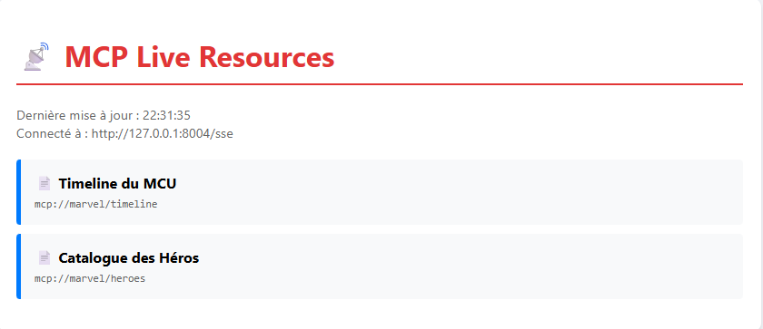

# 🦸 Demo LLM : Le Voyage de l'Apprenti AI-Agent

Bienvenue dans ce dépôt pédagogique conçu pour explorer et démontrer les capacités des Large Language Models (LLM) à travers un cas d'usage fil rouge ludique : l'univers **Marvel**.

Ce projet est conçu pour être **didactique** et **progressif**. Il part d'un simple appel API pour aboutir à une architecture d'entreprise complexe utilisant des agents autonomes et le protocole **MCP (Model Context Protocol)**.

---

## 🏗️ Architecture & Philosophie

*   **Approche Pas-à-Pas** : Le code est découpé en **Phases (A à E)**, elles-mêmes divisées en **Étapes numérotées**.
*   **Indépendance** : Chaque script est conçu pour être le plus autonome possible.
*   **Séparation Logic/UI** : Distinguo clair entre le cerveau (Serveur/Scripts) et les muscles (Streamlit).
*   **Aesthetics First** : Les interfaces visent un rendu premium pour une expérience utilisateur moderne.

---

## 🚀 Guide de Démarrage

1.  **Installation** :
    ```bash
    python -m venv .venv
    .venv\Scripts\activate
    pip install -r requirements.txt
    ```
2.  **Configuration** :
    Créez un fichier `.env` :
    ```env
    LLM_MODEL=gpt-4o-mini
    LLM_API_KEY=sk-...
    ```

---

## 🪜 Détail des Phases

### Phase A : Les Fondations (Prompting & Mémoire)
*Objectif : Comprendre comment envoyer une requête et gérer une conversation.*

*   **A01 : Simple API**
    Le point de départ. Une question, une réponse.
    

*   **A02 : Chat Terminal**
    Ajout de la mémoire. Le LLM se souvient des échanges précédents dans le terminal.
    

*   **A03 : Streamlit Chat**
    Passage au Web. Une interface de chat moderne et fluide.
    
    *Architecture :*
    

---

### Phase B : Connaissance & RAG (Retrieval Augmented Generation)
*Objectif : Connecter le LLM à vos propres documents.*

*   **B02 : RAG (Base de Données Vectorielle)**
    Le LLM "lit" des fiches sur les héros Marvel et répond en s'appuyant sur ces preuves.
    
    *Fonctionnement :*
    

*   **B03 : LangGraph Routing**
    Utilisation de LangGraph pour créer un "cerveau" qui décide du chemin : Question Marvel -> RAG / Question Générale -> Chat direct.
    
    
    *Logique du graphe :*
    

---

### Phase C : Données Structurées (Text-to-SQL)
*Objectif : Interroger des bases de données SQL en langage naturel.*

*   **C01 : Streamlit SQL**
    L'utilisateur demande "Combien de films pour Thor ?", le LLM génère et exécute le SQL.
    
    *Flux :*
    

*   **C02 : Catalog Explorer**
    Exploration d'un catalogue de métadonnées pour trouver la bonne table avant d'interroger.
    
    *Flux :*
    

---

### Phase D : Action & Outils (Tool Calling)
*Objectif : Autoriser le LLM à utiliser des outils externes.*

*   **D01 : Agent avec Outils**
    L'agent appelle un "Calculateur de Combat" (API externe) pour arbitrer qui gagne un duel.
    
    *Séquence :*
    

*   **D02 : Data Visualization**
    L'agent génère du code Python pour créer des graphiques dynamiques.
    
    *Processus :*
    

---

### Phase E : Industrialisation avec MCP
*Objectif : Standardiser les connexions via le Model Context Protocol.*

*   **E01 - E05** : Exploration des bases (Resources, Tools, Prompts, Progress bars).
*   **E06 : Notifications Temps Réel**
    Le serveur MCP pousse des notifications aux clients lors de changements de données.
    *Avant ajout :*
    
    *Après notification (Mise à jour automatique) :*
    
    *Architecture du flux :*
    

---

## 🛠️ Outils & Méthodologie
Ce projet démontre comment assembler brique par brique un écosystème d'IA agentique moderne, robuste et visuellement attractif.
Realized with the help of **Google Antigravity**.
