# 🦸 Demo LLM : Le Voyage de l'Apprenti AI-Agent

Bienvenue dans ce dépôt pédagogique conçu pour explorer et démontrer les capacités des Large Language Models (LLM) à travers un cas d'usage fil rouge ludique : l'univers **Marvel**.

Ce projet est conçu pour être **didactique** et **progressif**. Il part d'un simple appel API pour aboutir à une architecture d'entreprise complexe utilisant des agents autonomes et le protocole **MCP (Model Context Protocol)**.

---

## 🏗️ Architecture & Philosophie

*   **Approche Pas-à-Pas** : Le code est découpé en **Phases (A à E)**, elles-mêmes divisées en **Étapes numérotées**.
*   **Indépendance** : Chaque script est conçu pour être le plus autonome possible.
*   **Séparation Logic/UI** : Distinguo clair entre le cerveau (Serveur/Scripts) et les muscles (Streamlit).
*   **Aesthetics First** : Les interfaces visent un rendu premium pour une expérience utilisateur moderne.

---

## 🚀 Guide de Démarrage

1.  **Installation** :
    ```bash
    python -m venv .venv
    .venv\Scripts\activate
    pip install -r requirements.txt
    ```
2.  **Configuration** :
    Créez un fichier `.env` :
    ```env
    LLM_MODEL=gpt-4o-mini
    LLM_API_KEY=sk-...
    ```

---

## 🪜 Détail des Phases

### Phase A : Les Fondations (Prompting & Mémoire)
*Objectif : Comprendre comment envoyer une requête et gérer une conversation.*

*   **A01 : Simple API**
    Le point de départ. Une question, une réponse brute via l'API.
    - **Test** : Lancer `python A01_simple_api.py`.
    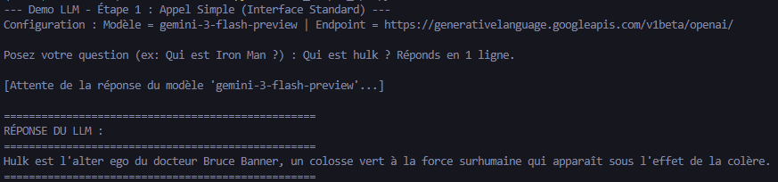

*   **A02 : Chat Terminal**
    Ajout de la mémoire. Le LLM se souvient des échanges précédents dans une boucle de chat en ligne de commande.
    - **Test** : Lancer `python A02_chat_terminal.py`.
    

*   **A03 : Streamlit Chat**
    Passage au Web. Une interface de chat moderne, fluide et persistante.
    - **Test** : Lancer `streamlit run A03_streamlit_chat.py`.
    
    *Architecture :*
    

---

### Phase B : Connaissance & RAG (Retrieval Augmented Generation)
*Objectif : Connecter le LLM à vos propres documents (Fiches héros Marvel).*

*   **B01/B02 : RAG (Base de Données Vectorielle)**
    Le LLM "lit" des documents texte et répond en s'appuyant sur ces connaissances tierces.
    - **Test** : 
        1. Gérer les données : `python B01_generate_data.py` (crée le dossier `data/`).
        2. Indexer : `python B02a_create_vector_db.py` (crée l'index FAISS).
        3. Interroger : `streamlit run B02c_streamlit_rag.py`.
    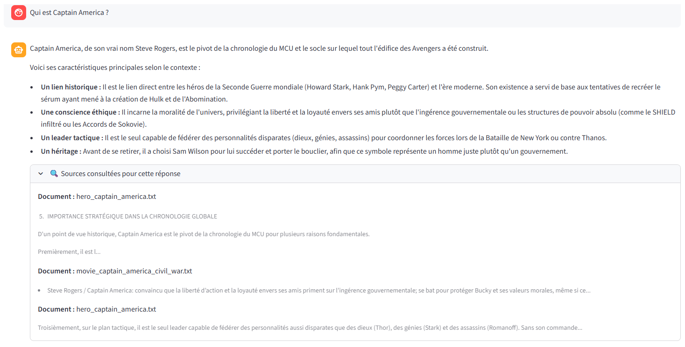
    *Fonctionnement :*
    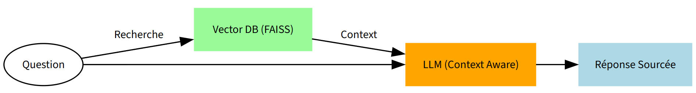

*   **B03 : LangGraph Routing**
    Introduction à la logique d'Agent. Un routeur intelligent décide si la question nécessite le RAG ou une réponse directe.
    - **Test** : Lancer `streamlit run B03_langgraph_routing.py`.
    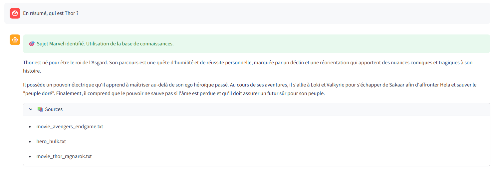
    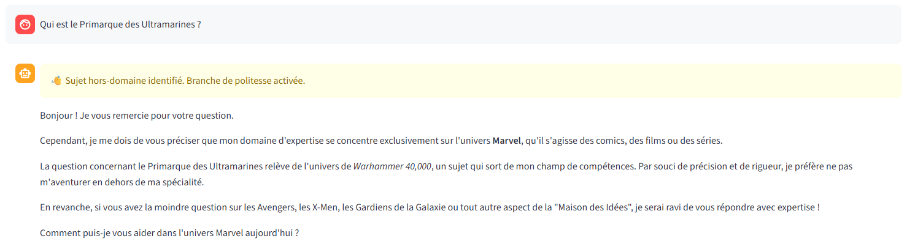
    *Logique du graphe :*
    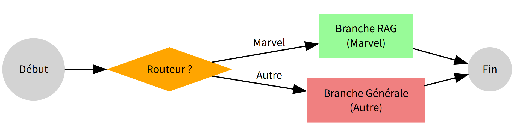

---

### Phase C : Données Structurées (Text-to-SQL)
*Objectif : Interroger des bases de données SQL d'entreprise en langage naturel.*

*   **C01 : Streamlit SQL**
    Le LLM convertit une demande ("Quels films pour Thor ?") en requête SQL complexe.
    - **Test** :
        1. Setup DB : `python C01a_setup_marvel_sql.py`.
        2. App : `streamlit run C01b_streamlit_sql.py`.
    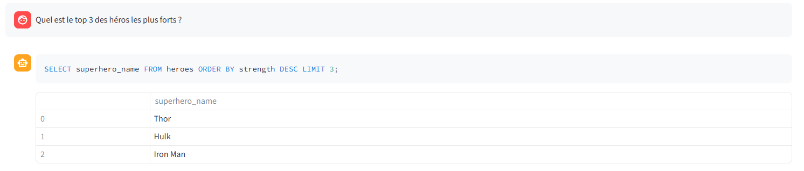
    *Flux :*
    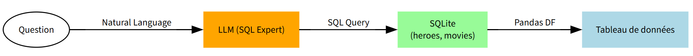

*   **C02 : Data Catalog Explorer**
    Le LLM explore d'abord un catalogue de métadonnées pour localiser l'information avant d'agir.
    - **Test** :
        1. Setup : `python C02a_setup_catalog.py`.
        2. App : `streamlit run C02b_streamlit_catalog.py`.
    
    *Flux :*
    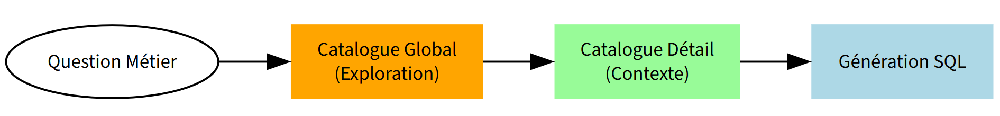

---

### Phase D : Action & Outils (Tool Calling)
*Objectif : Transformer le LLM en Agent capable d'agir sur le monde réel.*

*   **D01 : Agent avec Outils (Calculateur de Combat)**
    L'agent décide d'appeler un microservice externe pour obtenir une donnée technique.
    - **Test** :
        1. Lancer le service : `python D01a_combat_service.py` (Port 8002).
        2. Lancer l'Agent : `streamlit run D01b_streamlit_tools.py`.
    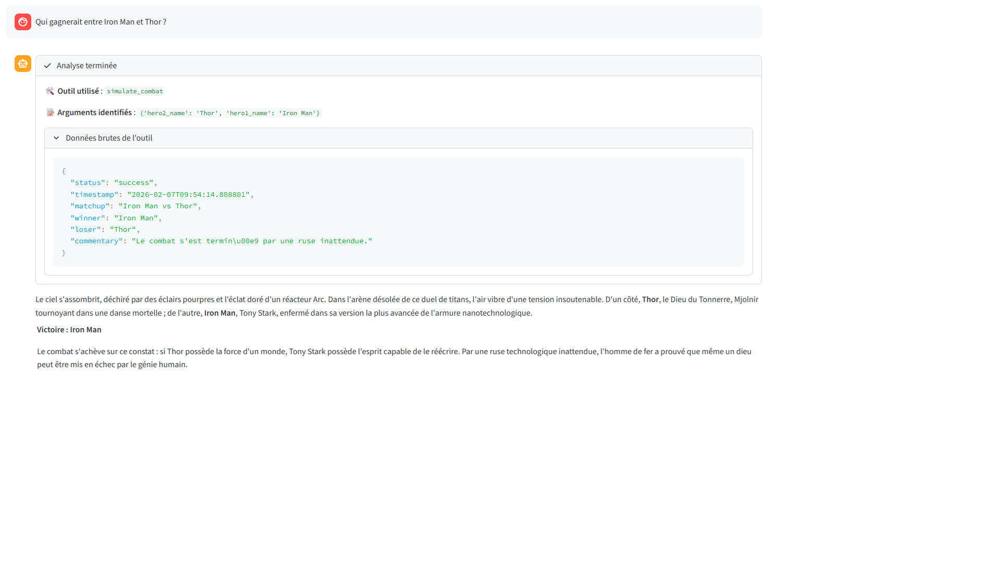
    *Séquence :*
    

*   **D02 : Data Visualization Agent**
    L'agent génère dynamiquement du code Python pour visualiser des données à la volée.
    - **Test** : Lancer `streamlit run D02_streamlit_charts.py`.
    
    *Processus :*
    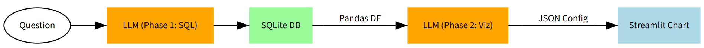

---

### Phase E : Industrialisation avec MCP (Model Context Protocol)
*Objectif : Standardiser l'écosystème IA via le protocole ouvert MCP d'Anthropic.*

*   **E01 : Discovery MCP (Outils dynamiques)**
    Le client découvre les capacités du serveur (outils) dynamiquement à la connexion.
    - **Test** : Serveur `E01a_mcp_server.py` + Client `E01b_streamlit_mcp.py`.
    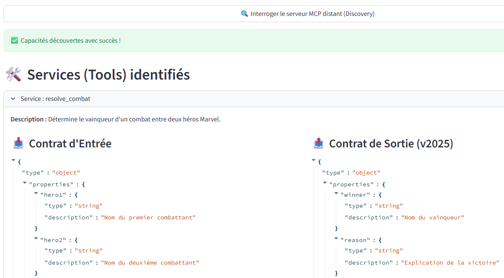
    *Flux :*
    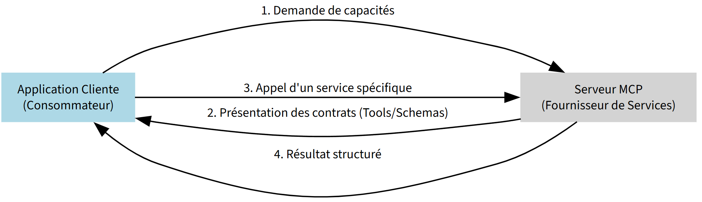

*   **E02 : Agent Autonome MCP**
    Un agent orchestré par LangGraph utilise les outils standardisés MCP.
    - **Test** : Serveur `E01a_mcp_server.py` + Agent `E02_streamlit_mcp_agent.py`.
    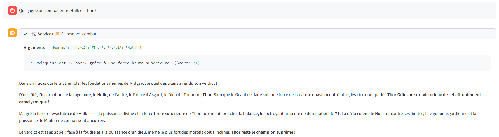
    *Flux :*
    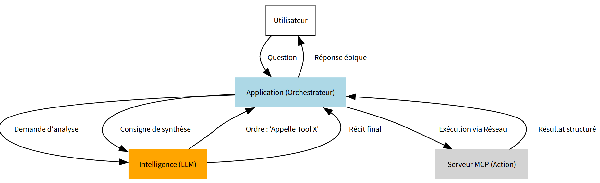

*   **E03 : Ressources MCP (Accès aux fichiers)**
    Lecture de fichiers Markdown ou logs distants via le protocole standardisé.
    - **Test** : Serveur `E03a_mcp_server_resources.py` + App `E03b_streamlit_mcp_resources.py`.
    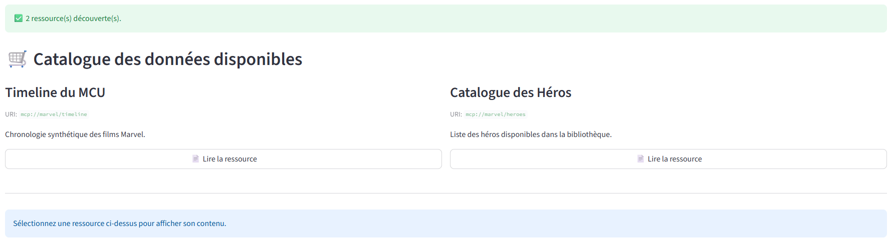
    *Flux :*
    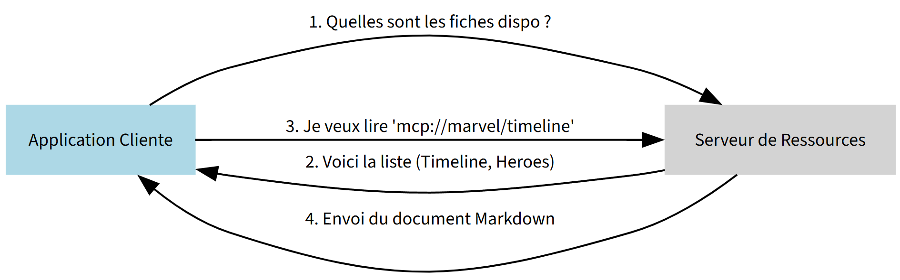

*   **E04 : Prompt Templates MCP**
    Utilisation de modèles de prompts partagés par le serveur pour guider l'agent.
    - **Test** : Serveur `E04a_mcp_server_templates.py` + App `E04b_streamlit_mcp_templates.py`.
    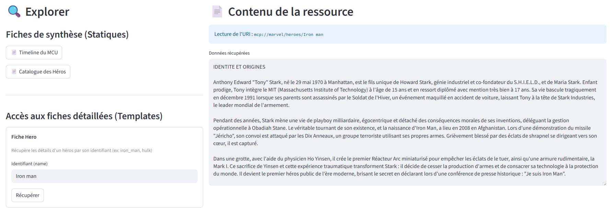
    *Flux :*
    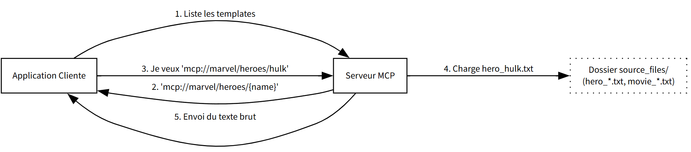

*   **E05 : Async Monitoring & Progress MCP**
    Suivi de tâches longues asynchrones avec barres de progression temps réel via MCP.
    - **Test** : Serveur `E05a_mcp_server_progress.py` + App `E05b_streamlit_mcp_progress.py`.
    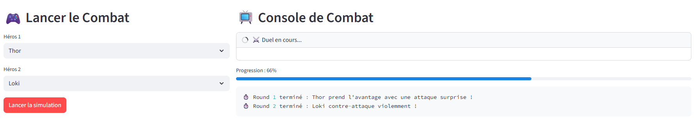
    *Flux :*
    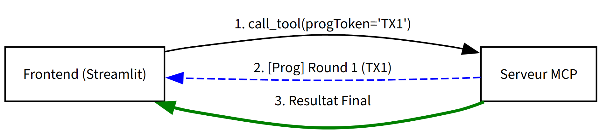

*   **E06 : Notifications Temps Réel (Server Push)**
    Démonstration ultime : Le serveur pousse une notification de changement de données sans demande du client.
    - **Test** :
        1. Serveur : `python E06a_mcp_server_notifications.py`.
        2. Client : `python E06b_mcp_client_html.py` (Génère `E06_viewer.html`).
        3. Admin : `streamlit run E06c_mcp_server_admin.py` (Ajoutez un ennemi).
        4. Voir le viewer HTML se mettre à jour instantanément.
    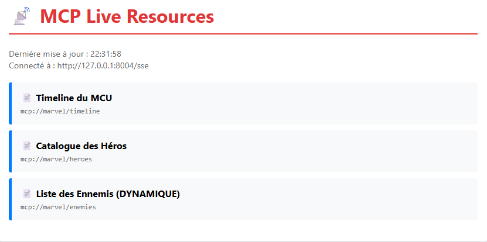
    *Architecture :*
    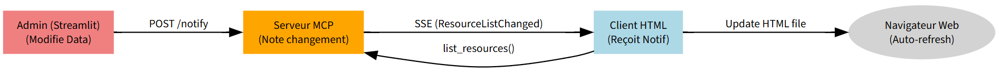

---

## 🛠️ Outils & Méthodologie
Ce projet a été réalisé avec l'assistance de **Google Antigravity** pour le codage, la structuration et la documentation premium.
Le code utilise les derniers standards (LangGraph, MCP, SSE) pour offrir une architecture "Future-Proof".
